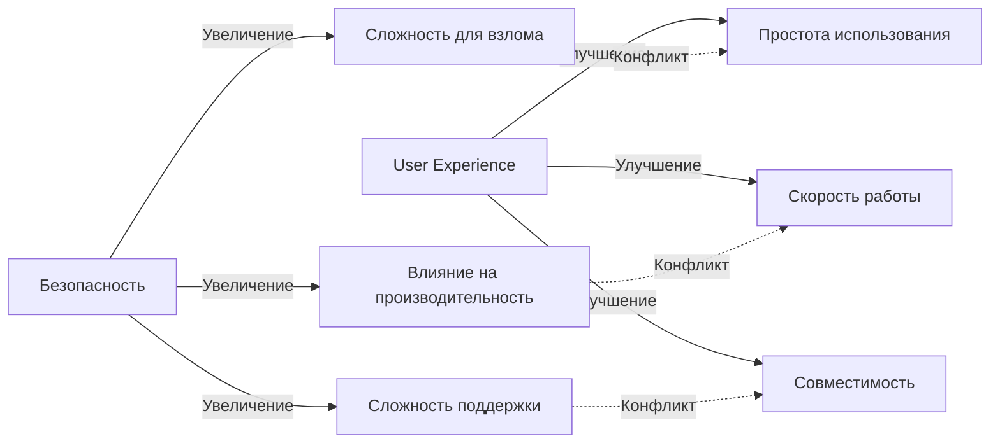

# 🛡️ Система Античита JavaOffer

<div align="center">

[]()
[]()
[]()

**Продвинутая многоуровневая система защиты от мошенничества**

• [🎯 Обзор](#-обзор) 
• [🏗️ Архитектура](#️-архитектура-системы) 
• [🔍 Детекция](#-типы-обнаруживаемых-нарушений) 
• [📱 Мобильная защита](#-мобильная-защита)

</div>

---

## 🎯 Обзор

Система античита JavaOffer представляет собой **комплексное решение** для обеспечения честности экзаменационного процесса. Система работает в реальном времени, анализируя поведение пользователя и обнаруживая попытки мошенничества с помощью передовых алгоритмов и многоуровневой защиты.

### 🏆 Ключевые преимущества

- **🔍 Реальное время** — мгновенное обнаружение нарушений
- **🧠 Интеллектуальный анализ** — поведенческие паттерны и алгоритмы ML
- **📱 Кроссплатформенность** — защита на всех устройствах и браузерах
- **🎭 Скрытность работы** — незаметная работа для пользователя
- **⚡ Высокая производительность** — минимальное влияние на UX
- **🔒 Безопасность кода** — критически важные компоненты скрыты

> ⚠️ **Важное замечание о безопасности**: В данном публичном репозитории **критически важные компоненты клиентской части** системы античита **намеренно скрыты** для обеспечения безопасности. Реальные названия файлов не раскрываются в открытом коде.

---

## 🏗️ Архитектура системы

### 🧩 Основные компоненты

Система состоит из нескольких взаимосвязанных модулей, каждый из которых отвечает за определенный аспект безопасности:

#### 1. 🎯 **Ядро безопасности** 
```javascript
// Основной модуль мониторинга (реальные названия скрыты)
[security-core-module].js
```
**Функции:**
- 📊 Отслеживание активности пользователя
- 💓 Отправка heartbeat-запросов на сервер
- 🔧 Обнаружение инструментов разработчика
- ⚡ Обработка событий нарушений в реальном времени
- 🛡️ Защита от вмешательства в работу системы
- 📱 Адаптация под мобильные устройства

#### 2. 🔍 **Монитор целостности**
```javascript
// Модуль проверки целостности (реальные названия скрыты)
[integrity-monitor].js
```
**Функции:**
- ✅ Проверка целостности других компонентов системы
- 🔄 Отслеживание попыток изменения ключевых объектов
- 🛠️ Автоматическое восстановление при вмешательстве
- 📱 Специальные проверки для мобильных устройств
- 🎨 Мониторинг Anti-OCR модуля

#### 3. 🚀 **Координатор системы**
```javascript
// Модуль инициализации и координации (реальные названия скрыты)
[system-coordinator].js
```
**Функции:**
- 🎛️ Координация работы всех компонентов
- ⚙️ Инициализация системы с правильными параметрами
- 🔄 Обновление состояния при смене вопросов
- 🎮 Управление жизненным циклом компонентов
- 📱 Настройка специфических проверок для мобильных устройств

#### 4. 🎨 **Anti-OCR защита**
```javascript
// Модуль защиты от OCR (реальные названия скрыты)
[anti-ocr-protection].js
[anti-ocr-config].js
```
**Функции:**
- 🎭 Динамические искажения текста для защиты от OCR
- 🖼️ Визуальные эффекты через Canvas API
- 🔄 Периодическое обновление алгоритмов защиты
- ⚙️ Гибкая конфигурация параметров
- 🛡️ Самозащита от отключения или модификации, способность к самовосстановлению поврежденных модулей

#### 5. 🧪 **Диагностический модуль**
```javascript
// Инструмент для тестирования (доступен для отладки)
anticheat-diagnostic-v2.js
```
**Функции:**
- 🔬 Проверка работоспособности всех систем
- 🐛 Диагностика и выявление проблем
- 🧪 Тестирование различных сценариев атак
- 🎭 Имитация нарушений для тестирования
- 📊 Проверка интеграции всех модулей

---

## 🔍 Типы обнаруживаемых нарушений

### 🛠️ Вмешательство в код и DOM

| Тип нарушения | Описание | Критичность |
|---------------|----------|-------------|
| **🔧 DevTools** | Открытие инструментов разработчика | 🔴 Высокая |
| **🏗️ DOM Tampering** | Модификация структуры DOM | 🔴 Высокая |
| **⚙️ Function Tampering** | Подмена JavaScript функций | 🔴 Высокая |
| **📦 Module Tampering** | Вмешательство в модули системы | 🔴 Высокая |

### 👤 Поведенческие нарушения

| Тип нарушения | Описание | Критичность |
|---------------|----------|-------------|
| **🔄 Tab Switch** | Переключение между вкладками | 🟡 Средняя |
| **📋 Text Copy** | Копирование текста вопросов | 🟠 Высокая |
| **❌ Page Close** | Попытка закрыть страницу экзамена | 🟡 Средняя |
| **🌐 External Content** | Внедрение внешних сркиптов | 🟠 Высокая |

### 📱 Мобильные нарушения

| Тип нарушения | Описание | Критичность |
|---------------|----------|-------------|
| **📱 Orientation Change** | Подозрительные изменения ориентации | 🟡 Средняя |
| **👆 Multi-touch** | Мультитач жесты для скриншотов | 🟠 Высокая |
| **🔄 App Switch** | Переключение между приложениями | 🟡 Средняя |
| **🛠️ Mobile DevTools** | Мобильные инструменты разработки | 🔴 Высокая |

### 🎨 Anti-OCR нарушения

| Тип нарушения | Описание | Критичность |
|---------------|----------|-------------|
| **🚫 Script Block** | Блокировка загрузки Anti-OCR | 🔴 Критическая |
| **🎭 Function Bypass** | Обход функций искажения | 🔴 Критическая |
| **⚙️ Config Tampering** | Модификация конфигурации | 🔴 Критическая |
| **🖼️ Canvas Block** | Блокировка Canvas API | 🔴 Критическая |

---

## 📱 Мобильная защита

### 🎯 Специализированные алгоритмы

Система включает продвинутые механизмы для защиты на мобильных устройствах:

#### 📐 **Анализ ориентации устройства**
```javascript
// Мониторинг изменений ориентации
const orientationMonitor = {
    detectSuspiciousChanges: () => {
        // Алгоритм обнаружения подозрительных изменений
        // (реализация скрыта в production коде)
    },
    validateOrientation: () => {
        // Проверка валидности значений ориентации
    }
};
```

#### 👆 **Анализ сенсорных событий**
- **🔍 Детекция мультитач** — обнаружение жестов для скриншотов
- **⏱️ Анализ тайминга** — проверка времени между касаниями
- **📊 Паттерн-анализ** — выявление подозрительных последовательностей

#### 👁️ **Мониторинг видимости страницы**
- **🔄 App switching** — переключение между приложениями
- **⏳ Hidden time tracking** — отслеживание времени скрытия
- **📊 Activity state** — мониторинг состояния активности

#### 🛠️ **Обнаружение мобильных DevTools**
- **🕵️ Eruda detection** — поиск популярных мобильных отладчиков
- **🔍 vConsole detection** — обнаружение консольных инструментов
- **🌐 URL parameter check** — проверка отладочных параметров

---

## ⚙️ Серверная обработка нарушений

### 🎯 Паттерн "Стратегия"

Система использует паттерн **Strategy** для обработки различных типов нарушений:

```java
public interface AntiCheatEventStrategy {
    void handleViolation(AntiCheatEvent event, ExamSession session);
}

// Реализации для разных типов нарушений
@Component
public class DevToolsEventStrategy implements AntiCheatEventStrategy {
    @Override
    public void handleViolation(AntiCheatEvent event, ExamSession session) {
        // Обработка открытия DevTools
        session.incrementDevToolsViolations();
        logSecurityEvent(event);
        
        if (session.getDevToolsViolations() >= maxViolations) {
            terminateExam(session, "DevTools detected");
        }
    }
}
```

### 📊 Накопление статистики

#### 🗃️ **Временное хранение (кэш сессии)**
```java
@Entity
public class TemporaryExamProgress {
    private int tabSwitchViolationCount;
    private int textCopyViolationCount;
    private int devToolsViolationCount;
    private int domTamperingViolationCount;
    private int functionTamperingViolationCount;
    private int antiOcrTamperingViolationCount;
    private boolean terminatedByViolations;
    // ... другие поля
}
```

#### 💾 **Постоянное хранение (база данных)**
```sql
-- Таблица истории результатов с данными о нарушениях
CREATE TABLE user_score_history (
    id BIGSERIAL PRIMARY KEY,
    user_id BIGINT NOT NULL,
    tab_switch_violations INTEGER DEFAULT 0,
    text_copy_violations INTEGER DEFAULT 0,
    devtools_violations INTEGER DEFAULT 0,
    dom_tampering_violations INTEGER DEFAULT 0,
    function_tampering_violations INTEGER DEFAULT 0,
    anti_ocr_tampering_violations INTEGER DEFAULT 0,
    -- ... другие поля статистики
);
```

### 🚨 Система принятия решений

```java
@Service
public class ViolationDecisionService {
    
    public boolean shouldTerminateExam(TemporaryExamProgress progress) {
        int totalTamperingViolations = 
            progress.getDevToolsViolationCount() +
            progress.getDomTamperingViolationCount() +
            progress.getFunctionTamperingViolationCount() +
            progress.getAntiOcrTamperingViolationCount();
            
        return totalTamperingViolations >= antiCheatProperties.getMaxTamperingViolations()
            || progress.getTabSwitchViolationCount() >= antiCheatProperties.getMaxTabSwitchViolations()
            || progress.getTextCopyViolationCount() >= antiCheatProperties.getMaxTextCopyViolations();
    }
}
```

---

## 🎨 Anti-OCR система

### 🖼️ Принципы работы

**Anti-OCR модуль** — это специализированная система защиты от автоматического распознавания текста:

#### 🎭 **Canvas-based искажения**
```javascript
// Пример концепции (реальная реализация скрыта)
const textDistortion = {
    applyDistortions: (textElement) => {
        // 1. Случайные смещения символов
        // 2. Вариация размеров шрифта
        // 3. Случайные повороты
        // 4. Цветовые искажения
        // (детальные алгоритмы скрыты в production)
    },
    
    periodicUpdate: () => {
        // Периодическое обновление алгоритмов
        // для предотвращения адаптации OCR систем
    }
};
```

#### ⚙️ **Конфигурируемые параметры**
```yaml
antiocr:
  enabled: true
  enabledForQuestionText: true
  enabledForCodeBlocks: true
  canvasMethod:
    enabled: true
    charSpacingVariation: 1.5
    charVerticalVariation: 10.0
    charRotationVariation: 25.0
    fontSizeVariation: 8.0
  textColor:
    lightTheme: "#cccccc"
    darkTheme: "#5c5c5c"
```

#### 🛡️ **Самозащита модуля**
- **🔍 Integrity checks** — периодическая проверка целостности
- **🚫 Bypass detection** — обнаружение попыток обхода
- **🔄 Auto-recovery** — автоматическое восстановление
- **📊 Event reporting** — отправка событий на сервер

---

## 🔒 Методы защиты системы

### 🎭 Обфускация и минификация

#### 📦 **Production защита**
- **🔐 Variable obfuscation** — обфускация имен переменных
- **📝 Function name mangling** — изменение имен функций  
- **🗜️ Code minification** — минификация кода
- **🔄 Control flow flattening** — усложнение логики

#### 🛡️ **Runtime защита**
- **🔍 Integrity verification** — проверка целостности между компонентами
- **🚫 Anti-tampering** — защита от переопределения методов
- **🔄 Self-healing** — самовосстанавливающиеся механизмы
- **🎭 Stealth operation** — скрытая работа системы

#### 📨 **Надежная отправка данных**
```javascript
// Множественные каналы отправки данных
const dataTransmission = {
    primaryChannel: fetch,
    fallbackChannel: XMLHttpRequest,
    emergencyChannel: navigator.sendBeacon,
    
    sendSecurely: (data) => {
        // Попытка отправки через разные каналы
        // с проверкой доставки
    }
};
```

### 🧬 Архитектурная защита

#### 🏗️ **Модульная изоляция**
```javascript
// Изолированные модули с защищенными интерфейсами
(function(global) {
    'use strict';
    
    const ProtectedModule = (() => {
        // Приватные переменные и функции
        let internalState = {};
        
        // Защищенный интерфейс
        return {
            // Только необходимые публичные методы
            init: () => { /* скрыто */ },
            check: () => { /* скрыто */ },
            report: () => { /* скрыто */ }
        };
    })();
    
    // Защита от переопределения
    Object.freeze(ProtectedModule);
    
})(this);
```

#### 🔄 **Взаимная проверка компонентов**
- **✅ Cross-validation** — модули проверяют друг друга
- **🔍 Heartbeat system** — система взаимного мониторинга
- **🚨 Anomaly detection** — обнаружение аномалий в работе
- **📊 State synchronization** — синхронизация состояний

---

## ⚠️ Ограничения и реалистичные ожидания

### 🎯 Целевая аудитория защиты

**Система эффективна против:**
- 🎓 **Обычных пользователей** — 95%+ защита
- 🔧 **Начинающих "хакеров"** — 80%+ защита  
- 🛠️ **Пользователей с базовыми знаниями JS** — 60%+ защита

**Система НЕ предназначена для защиты от:**
- 👨‍💻 **Профессиональных пентестеров**
- 🧠 **Экспертов по реверс-инжинирингу**
- 🔒 **Специалистов по информационной безопасности**

### 🎯 Баланс безопасности и UX



---

## 📊 Мониторинг и аналитика

### 📈 Dashboard для администраторов

#### 🔍 **Реальное время**
- **📊 Активные сессии** — текущие экзамены
- **🚨 Нарушения в реальном времени** — live мониторинг
- **⚡ Производительность системы** — метрики работы
- **🌍 География нарушений** — карта попыток взлома

#### 📋 **Исторические данные**
- **📊 Статистика по типам нарушений** - сохраняются в истории пользователей

### 📊 Метрики эффективности

```yaml
# Ключевые показатели системы (KPI)
detection_metrics:
  false_positive_rate: < 2%    # Ложные срабатывания
  detection_accuracy: > 95%    # Точность обнаружения
  response_time: < 100ms       # Время реакции
  system_overhead: < 5%        # Влияние на производительность

user_experience:
  perceived_slowdown: < 3%     # Ощутимое замедление
  compatibility_rate: > 99%    # Совместимость с браузерами
  error_rate: < 0.1%          # Частота ошибок
```

---

## 🚀 Будущее развитие

### 🧠 Планируемые улучшения

#### 🤖 **Машинное обучение**
- **📊 Behavioral ML** — алгоритмы анализа поведения
- **🔍 Anomaly detection** — обнаружение аномалий с помощью ИИ
- **🎯 Adaptive thresholds** — динамические пороги срабатывания
- **📈 Predictive analytics** — предсказание попыток мошенничества
---

## 🔧 Техническая документация

### 🛠️ API для разработчиков

#### 📡 **Event Reporting API**
```javascript
// Интерфейс для отправки событий безопасности
window.SecurityReporter = {
    reportViolation: (type, details) => {
        // Безопасная отправка события на сервер
        // (реализация скрыта в production)
    },
    
    getSessionStatus: () => {
        // Получение статуса текущей сессии
        // возвращает зашифрованные данные
    }
};
```

#### ⚙️ **Configuration API**
```javascript
// Интерфейс для конфигурации (только для админов)
window.SecurityConfig = {
    updateThresholds: (newThresholds) => {
        // Обновление порогов срабатывания
        // доступно только с административными правами
    },
    
    toggleModule: (moduleName, enabled) => {
        // Включение/выключение модулей
        // с проверкой прав доступа
    }
};
```
<div align="center">

## 🎯 Заключение

**Система античита JavaOffer** — это **enterprise-grade решение** для защиты экзаменационного процесса, сочетающее:

- 🛡️ **Многоуровневую защиту** от всех известных типов мошенничества
- ⚡ **Высокую производительность** с минимальным влиянием на UX  
- 🧠 **Интеллектуальные алгоритмы** анализа поведения
- 🔒 **Надежную защиту кода** с использованием современных методов обфускации
- 📱 **Кроссплатформенную совместимость** для всех современных устройств

Система готова для использования в **production среде** и обеспечивает **надежную защиту** от попыток мошенничества на уровне, достаточном для большинства образовательных и корпоративных сценариев.

---

**⚠️ Критически важные компоненты системы намеренно скрыты в публичном репозитории для обеспечения безопасности ⚠️**

---

*Made with 🛡️ and ☕ by JavaOffer Team*

</div>
